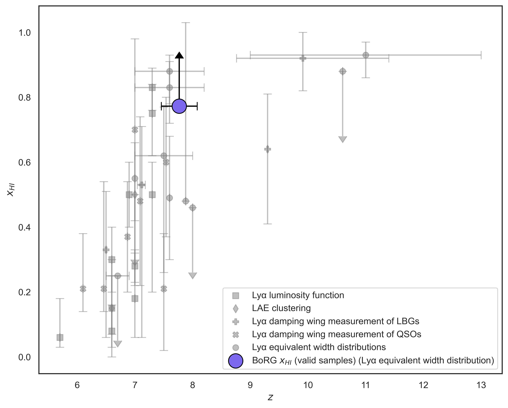

<head>
  <link type="text/css" rel="stylesheet" href="main.css" />
</head>
<body>
  
<h1>Bio</h1>
 Hey, I'm Lucas Barclay and I'm an astrophysics student researching tidal disruption events (TDEs) of population III stars through an MPhil at the University of Cambridge. I have roughly a year's worth of experience working alongside Dr. Guido Roberts-Borsani in two research projects centred around high-redshift galaxies (see my research projects below). Additionally, I wrote a literature review which explored the neutrino mass tension and its connection to the optical depth to reionisation $\tau$ with Prof. Richard Ellis. My main interests include population III stars, galaxy evolution, ionisation history, the EoR, and climate science (shockingly a non-astrophysics subject). 

The Epoch of Reionisation (EoR) has received significant attention with the launch of the James Webb Space Telescope (JWST), expanding our catalogue of galaxies significantly and shedding light on an unexpected abundance of luminous galaxies at high redshifts. Naturally, this point in cosmological history has piqued my interest, sitting at the forefront of modern astrophysical research. A topic I have found interest in is the nature of reionisation; is it a uniform or patchy process? How do we measure the optical depth to reionisation $\tau$? What are the first sources of reionisation? These questions are the primary focus of my research, with that final question explored through my research of population III stars.

Population III stars are the Megalodons of astrophysics; we are almost certain they exist but we have yet to make a tentative detection (or in the Megalodons case, a full skeleton).

<h1>Research projects</h1>
<b>Extragalactic smurfs: Investigating the escape fractions of ultra-blue high-redshift galaxies (June 2025 - September 2025)</b>

<b>Measuring the neutral hydrogen fraction *$x_{HI}$* via a forward modelling approach of BoRG galaxies (August 2025 - April 2026)</b>

</body>
